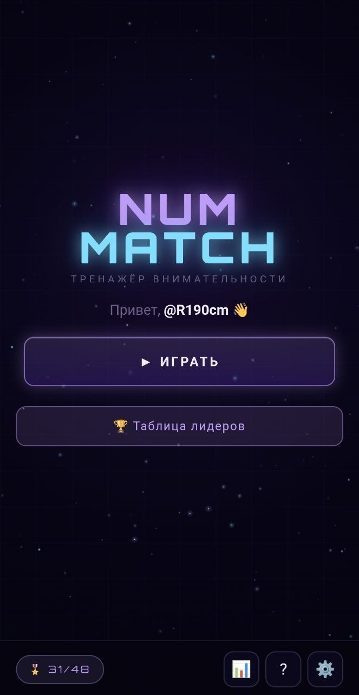
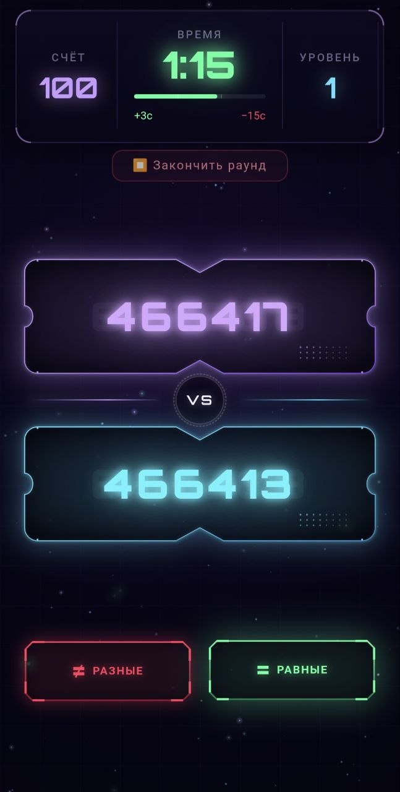
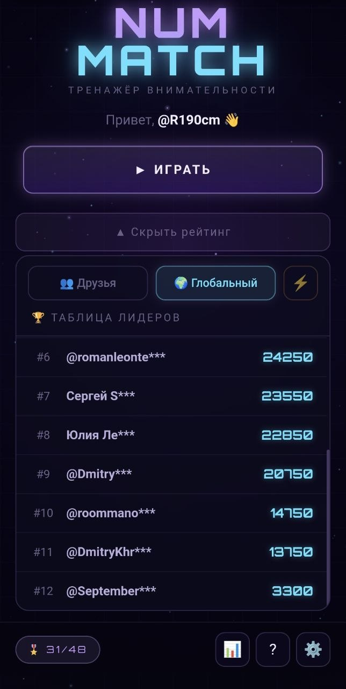
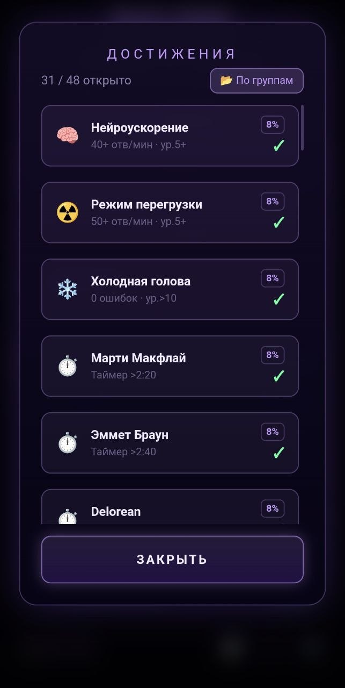
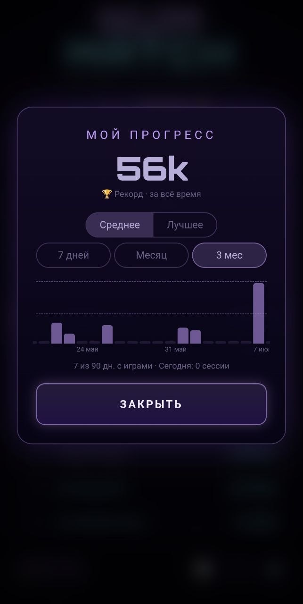

# 🎮 NumMatch

Тренажёр внимательности в формате Telegram Mini App. Сравнивай числа на скорость, попади в мировой топ.

**Стек:** React + Vite + TypeScript · Node.js (vanilla HTTP) · PostgreSQL · Telegram Bot API

## Скриншоты

<p>
  
  
  
  
  
</p>

---

## Развёртывание с нуля

### Что нужно заранее

- VPS с Ubuntu 22.04 / Debian 12 (минимум 1 CPU, 1 GB RAM)
- Домен, направленный A-записью на IP сервера
- Telegram Bot Token от @BotFather
- SSH-доступ к серверу

---

### 01 — Установка Node.js

```bash
# Обновляем систему
sudo apt update && sudo apt upgrade -y

# Добавляем репозиторий Node.js 20
curl -fsSL https://deb.nodesource.com/setup_20.x | sudo -E bash -
sudo apt install -y nodejs

# Проверяем
node --version   # v20.x.x
npm --version
```

---

### 02 — Установка PostgreSQL

```bash
sudo apt install -y postgresql postgresql-contrib

# Запускаем и включаем автостарт
sudo systemctl start postgresql
sudo systemctl enable postgresql
```

---

### 03 — Создание базы данных

```bash
sudo -u postgres psql
```

```sql
-- Создаём пользователя
CREATE USER nummatch WITH PASSWORD 'ВАШ_ПАРОЛЬ';

-- Создаём базу данных
CREATE DATABASE nummatch OWNER nummatch;

-- Даём права
GRANT ALL PRIVILEGES ON DATABASE nummatch TO nummatch;

\q
```

> Таблицы создадутся автоматически при первом запуске `server.js` — миграции уже написаны в коде.

---

### 04 — Клонирование репозитория

```bash
cd /home
git clone https://github.com/roman110394/NumMatch.git nummatch
cd nummatch
npm install
```

---

### 05 — Файл .env

```bash
nano /home/nummatch/.env
```

```env
# PostgreSQL
PG_HOST=localhost
PG_PORT=5432
PG_DB=nummatch
PG_USER=nummatch
PG_PASSWORD=ВАШ_ПАРОЛЬ

# Telegram Bot
BOT_TOKEN=123456:ABC-токен-от-BotFather
WEBHOOK_SECRET=придумай-любую-строку-32-символа
ALERT_CHAT_ID=твой-telegram-user-id

# Сервер
PORT=3000
GAME_URL=https://твой-домен.com
GROUP_ID=-1001234567890
```

> `ALERT_CHAT_ID` — числовой ID в Telegram. Узнать: напиши боту `@userinfobot`.  
> `GROUP_ID` — ID основной группы (необязательно).

---

### 06 — Билд и первый запуск

```bash
cd /home/nummatch

# Собираем фронтенд
npm run build

# Копируем в public
cp -r dist/* public/

# Тестовый запуск (Ctrl+C чтобы остановить)
node server.js
```

Если в консоли видишь `✅ PostgreSQL подключён` и `✅ Webhook зарегистрирован` — всё работает.

---

### 07 — PM2 (автозапуск)

```bash
sudo npm install -g pm2

cd /home/nummatch
pm2 start server.js --name nummatch
pm2 save
pm2 startup
# Выполни команду которую выведет pm2 startup

# Полезные команды:
pm2 status
pm2 logs nummatch
pm2 restart nummatch
```

---

### 08 — Nginx

```bash
sudo apt install -y nginx
sudo nano /etc/nginx/sites-available/nummatch
```

```nginx
server {
    listen 80;
    server_name твой-домен.com;

    location / {
        proxy_pass http://localhost:3000;
        proxy_http_version 1.1;
        proxy_set_header Upgrade $http_upgrade;
        proxy_set_header Connection 'upgrade';
        proxy_set_header Host $host;
        proxy_set_header X-Real-IP $remote_addr;
        proxy_cache_bypass $http_upgrade;
    }
}
```

```bash
sudo ln -s /etc/nginx/sites-available/nummatch /etc/nginx/sites-enabled/
sudo nginx -t
sudo systemctl restart nginx
```

---

### 09 — SSL (HTTPS)

```bash
sudo apt install -y certbot python3-certbot-nginx
sudo certbot --nginx -d твой-домен.com

# Проверяем автообновление
sudo certbot renew --dry-run
```

---

### 10 — Telegram Webhook

Webhook регистрируется автоматически при старте сервера. Проверить вручную:

```bash
curl https://api.telegram.org/botВАШ_BOT_TOKEN/getWebhookInfo
```

В ответе должно быть `"url": "https://твой-домен.com/api/webhook"`.

В @BotFather настрой кнопку меню: `/setmenubutton` → URL: `https://твой-домен.com`

---

### Обновление кода

```bash
cd /home/nummatch
git pull
npm run build
cp -r dist/* public/
pm2 restart nummatch
```

---

### Бэкап базы данных

```bash
mkdir -p /home/nummatch-backups
crontab -e
```

```cron
# Бэкап каждый день в 3:00
0 3 * * * pg_dump -U nummatch -d nummatch > /home/nummatch-backups/backup_$(date +\%Y\%m\%d).sql

# Удаляем бэкапы старше 30 дней
0 4 * * * find /home/nummatch-backups/ -name "*.sql" -mtime +30 -delete
```

Восстановление:

```bash
psql -U nummatch -d nummatch < /home/nummatch-backups/backup_20260710.sql
```

---

### Диагностика

| Команда | Что проверяет |
|---------|--------------|
| `pm2 status` | Статус процесса |
| `pm2 logs nummatch` | Логи в реальном времени |
| `sudo systemctl status nginx` | Nginx работает ли |
| `sudo systemctl status postgresql` | PostgreSQL работает ли |
| `curl localhost:3000/api/stats` | API отвечает ли |
